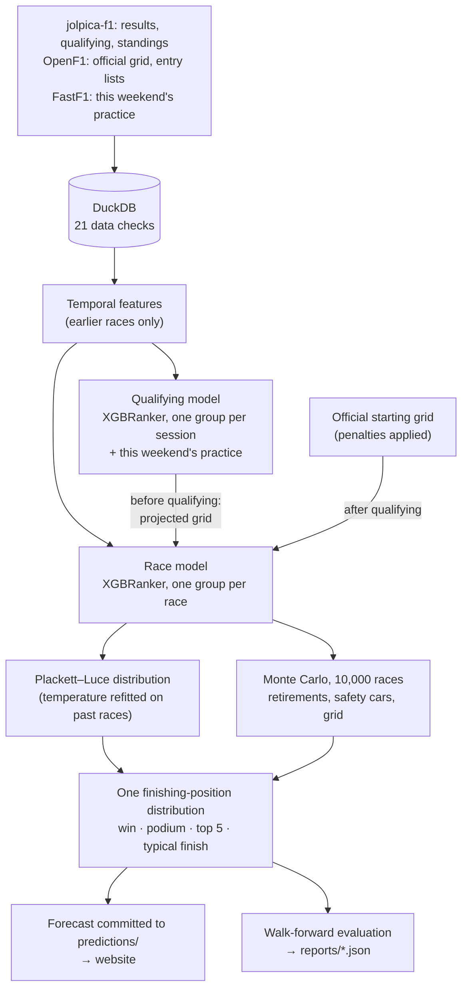

# F1 Prediction System

[](https://github.com/Parikshit06/f1pred/actions/workflows/ci.yml)

Forecasts each Formula 1 race as probabilities (win, podium, top 5, expected
finish), publishes the forecast before the session, and grades it against the
result afterwards.

Each weekend it logs three forecasts: before practice (on the Wednesday of race
week, history only), after practice (which feeds a qualifying forecast, and so
a projected grid) and after qualifying (on the official grid). It then measures honestly whether anything
beyond that grid improves the forecast.

**[Live forecast](https://parikshit06.github.io/f1pred/)** ·
**[How it works](https://parikshit06.github.io/f1pred/method.html)** ·
**[Backtest results](reports/backtest.json)** ·
**[Full methodology](METHODOLOGY.md)**

## At a glance

| | |
|---|---|
| **Predicts** | Every Grand Prix: each driver's chance to win, reach the podium and the top 5, and their typical (median) finish; also qualifying and the championship |
| **Data** | Results, qualifying and standings since 2018 (jolpica-f1); official grids and entry lists (OpenF1); this weekend's practice times (FastF1) |
| **Model** | XGBoost learning-to-rank with one query group per race; a second ranker forecasts qualifying |
| **Probabilities** | A Plackett–Luce distribution, temperature refitted on past races only, mixed with 10,000 Monte Carlo races |
| **Evaluation** | Walk-forward: settings chosen on 2022–23, then 63 races (2024 to 2026 round 15) graded against simple references with paired bootstrap intervals |
| **Limitations** | After qualifying it does not beat the calibrated starting grid; its most confident podium and top-10 calls are over-confident; weather, strategy and safety-car timing are not modelled |

## Key results

Walk-forward over **63 races** (2024 round 1 to 2026 round 15): each race
forecast by models trained only on earlier races, with settings chosen on
2022–23. Each model is compared with a forecast that needs no model, with a 95%
interval over races; "inconclusive" means the interval includes zero.

| Stage | Metric | Model | Reference | Difference (95% interval) | Verdict |
|---|---|---|---|---|---|
| After qualifying | NDCG@3 | 0.852 | 0.857 (grid) | -0.005 (-0.031 to +0.021) | inconclusive |
| | NDCG@5 | 0.895 | 0.897 (grid) | -0.002 (-0.019 to +0.015) | inconclusive |
| | Winner called | 67% | 59% (grid) | +8 pts (-3 to +19) | inconclusive |
| | Win log loss | 1.201 | 1.341 (grid) | -0.141 (-0.358 to +0.062) | inconclusive |
| | Podium Brier | 0.069 | 0.069 (grid) | -0.000 (-0.006 to +0.006) | inconclusive |
| | Kendall | 0.521 | 0.549 (grid) | -0.028 (-0.054 to -0.002) | **grid better** |
| Before qualifying | Win log loss | 1.740 | 2.128 (championship order) | -0.387 (-0.635 to -0.124) | **model better** |
| | Podium Brier | 0.084 | 0.096 (championship order) | -0.011 (-0.018 to -0.004) | **model better** |
| | Top-5 overlap | 3.71 of 5 | 3.44 of 5 (championship order) | +0.270 (+0.079 to +0.476) | **model better** |
| Qualifying | Pole log loss | 1.677 | 2.089 (recent qualifying form) | -0.412 (-0.667 to -0.161) | **model better** |
| | NDCG@5 | 0.859 | 0.814 (recent qualifying form) | +0.046 (+0.024 to +0.069) | **model better** |

**The starting grid carries most of the raw finishing-order signal.** Once it
is known, the model does not beat a calibrated grid: its win log loss is 0.141
lower, but the interval runs from -0.36 to +0.06, and on one metric the grid
is clearly better. The model's clear gains are before qualifying and in
forecasting qualifying itself. (An earlier version of this project claimed a
large lead over the grid; that grid baseline had never been calibrated.)

## How it works

- **Race-level learning-to-rank.** A race is an ordering, so an XGBoost ranker
  (`rank:ndcg`) is trained with one query group per race: every pairwise
  comparison in a race is a training signal, not one "winner" label.
- **No look-ahead.** Every feature is built only from earlier races, and tests
  prove it: rebuilding features from data that stops at a race changes nothing
  before it, and rewriting a result moves nothing up to that race.
- **Walk-forward evaluation.** No random splits. Settings are chosen on
  2022–23 and reported on 2024 onward, never on the races they are graded on.
- **Calibrated, coherent probabilities.** Scores become one finishing-position
  distribution per race, so win ≤ podium ≤ top 5 always holds, and the
  temperature that sharpens it is refitted only on past races.
- **Monte Carlo for race-day uncertainty.** 10,000 simulated races add
  retirements, safety cars and (before qualifying) an uncertain grid, mixed
  with the ranker's own probabilities.

## Architecture



## Quick start

No API keys, no data download: the demo runs the whole pipeline on a seeded
synthetic championship.

```bash
git clone https://github.com/Parikshit06/f1pred.git && cd f1pred
make setup   # exact versions from uv.lock (Python 3.11–3.13)
make demo    # ingest → features → walk-forward → forecast → site, offline
```

`make test` runs the unit, leakage and end-to-end tests. With real data:

```bash
make data-jolpica SEASONS=2018-2026   # ~15 min first time, rate-limited, cached
make data-openf1                      # official grids and entry lists
make repair validate features
make predict dashboard                # forecast the next race, render the site
make backtest experiments verify      # regenerate reports/*.json
```

---

The rest of this page is the technical detail. [METHODOLOGY.md](METHODOLOGY.md)
has the full method.

## Results in detail

After qualifying, against the calibrated grid and championship order
(`reports/backtest.json`, generated by `make backtest`):

| Approach | NDCG@3 | NDCG@5 | Winner | Podium overlap | Win log loss | Podium Brier |
|---|---|---|---|---|---|---|
| **This model** | 0.852 | 0.895 | **67%** | 1.92 of 3 | **1.201** | **0.069** |
| Grid order, calibrated | **0.857** | **0.897** | 59% | **2.05 of 3** | 1.341 | **0.069** |
| Championship order | 0.756 | 0.808 | 30% | 1.68 of 3 | 2.128 | 0.096 |

On one metric, the grid is clearly better: Kendall rank correlation over the
whole field, -0.028 (-0.054 to -0.002); every other interval includes zero.

**Calibration.** When the model says X%, the average gap to what happened
(expected calibration error, per driver) is 0.5% for wins, 2.8% for podiums
and 6.1% for the top ten. The method page shows it band by band.

## Leakage prevention

- Rolling windows shift a whole race before aggregating; team features
  collapse to one value per team per race first, so a driver never sees the
  teammate's result from the same race.
- **Truncation test**: features built from data ending at race *k* equal
  features built from everything, for every race up to *k*. It caught a real
  leak: a season-progress feature divided by the number of races already run.
- **Tampering test**: reversing one race's result moves no feature of that
  race or any earlier one.
- The walk-forward trains on `race_seq < k` only, and a test spies on every fit
  to prove it. Before qualifying, every grid and qualifying input is replaced by
  its projection, so the real result can't reach a pre-qualifying forecast.

## What each piece is worth

`make experiments` writes `reports/experiments.json`. Every experiment is a
walk-forward with race-paired intervals. Choices are made on 2022–23 and
checked on 2024 onward (practice, below, has its own held-out split). Each was made
once, on the final configuration, and is not re-decided when the evaluation is
refreshed. Experiments fit one seed per model, so their figures sit slightly
off the headline's five-seed ones.

**Calibration and the simulation.** The same out-of-sample scores on 2024
onward, turned into probabilities five ways:

| Probability step | Win log loss | Podium Brier | Calibration error, win |
|---|---|---|---|
| Raw scores (temperature 1, no simulation) | 1.686 | 0.0747 | 3.8% |
| Temperature fitted on 2022–23, held | **1.226** | 0.0679 | 0.3% |
| Temperature refitted on the last 24 races (in use) | 1.229 | 0.0683 | 0.4% |
| Refitted, Plackett–Luce only | 1.301 | 0.0716 | 0.3% |
| Refitted, simulation only | 1.256 | **0.0651** | 0.5% |
| Refitted on the first three finishers, not just the winner | 1.261 | 0.0662 | 1.0% |

Calibration is most of the gain. A held and a refitted temperature are level,
and mixing the two probability models beats either alone on log loss. Fitting
the temperature on the first three finishers was tested against the
over-confident podium and top-10 calls: it improves their calibration on both
2022–23 and 2024 onward, but worsens win log loss on 2022–23 (0.928 against
0.883), so it is not used. It is a real trade-off, not a free fix.

**Ablation: what adds information once the grid is known.**

- **Everything together vs the grid alone**: log loss 0.840 vs 1.628 on
  2022–23 (difference +0.788, interval +0.462 to +1.155), but 1.229 vs 1.326 on
  2024 onward (not clear).
- **Adding one block at a time to the grid** (log loss on 2022–23): grid only
  1.628, + driver form 0.957, + team form 1.220, + both 0.914, full model
  0.840. Recent driver form carries most of what the model adds beyond the
  grid; on 2024 onward none of these differences is clear.
- **Driver form and team form** are the groups whose removal clearly costs
  log loss on 2022–23: +0.186 (+0.046 to +0.348) and +0.082 (+0.004 to
  +0.168). Removing **circuit history** clearly hurts ranking (NDCG@5 -0.011,
  -0.021 to -0.001).
- **Qualifying position and gap to pole** duplicate the grid (correlation
  0.95 with it): removing them changes nothing clearly. They stay because they
  are how a car that took a grid penalty is recognised as fast.
- **Tested and left out**: the driver's own qualifying record (average grid
  and qualifying place, pole rate, one-lap gap) made 2022–23 clearly worse
  after qualifying, +0.078 (+0.027 to +0.138), and before it, +0.043 (+0.009
  to +0.078). It reaches the race through the grid already, so inside the race
  model it counted twice. The teammate qualifying gap also made it worse,
  +0.049 (+0.010 to +0.089). Both, as rolling averages, still feed the
  qualifying model.
- On 2024 onward, no single group's removal or addition is clear either way.

**Practice pace (FP1–FP3): qualifying only, earned on held-out data.**
Practice is used as this weekend's evidence, never as a long-term driver
feature: each driver's gap to the fastest car in each session, their latest
session's gap and rank, the gap to their teammate, the team's best car, the
change from FP1 to FP2 to FP3, and how consistent those were. Stored as
compact numbers for 59 weekends of 2024–26, no telemetry. The design was
chosen on 2024, then graded on 35 untouched weekends of 2025–26 against the
same model without practice:

| Qualifying forecast, with practice minus without (2025–26) | Difference (95% interval) |
|---|---|
| Qualifying position error (places) | -0.280 (-0.429 to -0.128) |
| Pole log loss | -0.203 (-0.404 to -0.009) |
| NDCG@5 | +0.028 (+0.000 to +0.059) |
| NDCG@3 | +0.040 (-0.006 to +0.089) |

Practice clearly improves the qualifying forecast, so it feeds the qualifying
model. After qualifying it adds nothing beyond the official grid (race log loss
+0.029, -0.051 to +0.117), so the race model never sees it. (An earlier
version kept practice on a test that overlapped the reported window; a
simpler two-number design, re-tested properly, was not clearly better.)

**Recent form: median, not mean.** Median finishing position over the last
races lowered 2022–23 log loss by 0.047 (interval 0.003 to 0.093). On 2024
onward the difference is not clear (-0.018 for the mean, -0.068 to +0.035). An
earlier configuration measured the same gain with an interval just touching
zero, so it is a marginal call, made once and not revisited.

**XGBoost settings** were compared on 2021 and on 2022–23 without intervals,
as a stability check rather than a search. No candidate is best on both:
depth 3 is best on 2022–23 and among the worst on 2021. The settings in use
(depth 4, 400 trees) are kept.

## Explainability

Every logged forecast stores, for each driver, SHAP contributions from XGBoost's
own TreeSHAP (`pred_contribs`, identical to `shap.TreeExplainer`). The published
score averages five seeds standardised within the race, so each seed's values
are centred and scaled the same way and averaged. The contributions then sum
exactly to the score that was published (tested). They describe what the model
relied on, not causes.

## Limitations

- Win probabilities are well calibrated overall, but the few win calls above
  70% came true less often than stated (too few races to say by how much).
  The most confident podium and top-10 calls are over-confident: podium calls
  averaging 94% came true 78% of the time, and top-10 calls
  averaging 96% came true 87%, because the temperature is fitted on winners only.
- Not modelled: weather, tyre and pit strategy, in-race penalties, team orders,
  upgrades, safety-car timing, failures shared by a team's two cars.
- Until the official grid is published, penalties are unknown and the
  qualifying order stands in; the forecast says so.
- 63 test races separate the model from naive baselines. Against the
  calibrated starting grid it is level on probabilities and behind on ordering
  the field.
- The season projection assumes current form holds, widened by a calibrated
  pace-drift term.

## Championship projection

The rest of the season is simulated 10,000 times, sprints included, from each
driver's median score over their last eight real weekends. Every driver with
points stays in the title race, including one sitting out a race. Graded on
27 checkpoints across 7 completed seasons (2019–2025), each projected with a
model trained only on races before it:

- **Who wins**: the favourite was right 89% of the time, Brier 0.077. That
  is a low bar: the favourite was simply the points leader at 26 of 27
  checkpoints, and backing the leader would have been right 85% of the time.
  Above 95% it is 14 for 14, but the 95% interval on that runs down to
  0.79, so a published 99.9% means the arithmetic says it's over, not one
  chance in a thousand. The misses are all in 2025's Piastri–Norris season
  (after rounds 8, 13 and 18).
- **How close**: every points total carries a 10th–90th percentile range,
  sized on 2019–22 and graded on 2023–25 (`make calibrate-spread`):

| Projection | Constructors inside the range | Width | Teammate gap inside | Target |
|---|---|---|---|---|
| Race luck only | 54% | 39 pts | 72% | 80% |
| **With the season-long pace term** | **86%** | 108 pts | 74% | 80% |

The pace term was sized on 2019–22, and on 2023–25 constructors land a little
wide of the target (86% against 80%). The teammate gap is still short of 80%:
on 2019–22 the ranges needed no extra driver term, but on 2023–25 they were too
narrow.

## Project structure

```
src/f1pred/
  ingest/            jolpica, OpenF1 (grid, entries), FastF1 (practice aggregates)
  store.py           DuckDB schema; raw tables never overwritten
  validate.py        21 data checks
  weekend.py         who is in the race, and where each car starts
  features.py        temporal feature layer
  model.py           XGBoost rankers, ensemble SHAP
  probability.py     Plackett–Luce, calibration, one coherent distribution
  simulate.py        Monte Carlo race simulation; forecast()
  predict.py         forecast one race, with provenance
  baselines.py       grid order and other no-model forecasts
  backtest.py        walk-forward, tuning
  metrics.py         ranking and probability metrics, bootstrap
  evaluation.py      headline backtest and experiments
  championship.py    season projection (sprints included)
  verify.py          release gate: leakage, calibration, coherence
  report*.py, method_page.py   the website
  demo.py            synthetic championship for make demo and CI
predictions/         every logged forecast (the track record)
reports/             measured figures; the README is tested against them
tests/               unit, leakage, pipeline (end-to-end on the demo data)
```

## Data and licence

Code: MIT. Data belongs to its sources: [jolpica-f1](https://github.com/jolpica/jolpica-f1)
(CC BY-NC-SA 4.0, see its [terms](https://github.com/jolpica/jolpica-f1/blob/main/TERMS.md)),
[OpenF1](https://openf1.org), [FastF1](https://github.com/theOehrly/Fast-F1).
